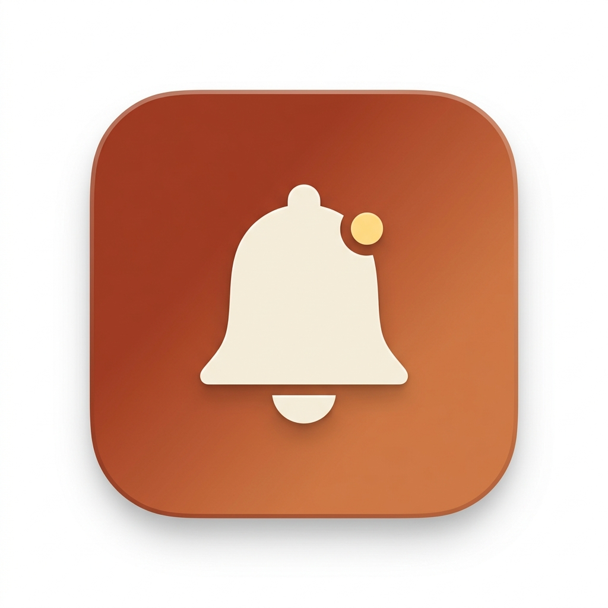

<p align="center">
  
</p>

# Glimpse

A lean macOS menu bar app for tracking GitHub PRs and notifications.

- Live dashboard of PRs you authored, are reviewing, or are assigned
- Status dots: CI state, mergeable, review decision
- Mac notifications when a PR is merged, becomes ready to merge, or fails CI on a new commit
- Mac notifications for GitHub inbox items (mentions, review requests, comments) using the `/notifications` API with conditional polling — free when nothing has changed
- All on a single GraphQL query per poll

Inspired by [Trailer](https://github.com/ptsochantaris/trailer), but smaller and SwiftUI-only.

## Requirements

- macOS 14 (Sonoma) or later
- Xcode Command Line Tools (`xcode-select --install`)
- `openssl` (the system `/usr/bin/openssl` is fine)
- A GitHub personal access token

## Install

```sh
git clone https://github.com/<you>/glimpse.git
cd glimpse
./scripts/setup-cert.sh   # one-time, creates a self-signed code signing identity
make run
```

`make run` builds, signs, and launches the app. The signed identity is reused on every rebuild so the macOS Keychain doesn't re-prompt for your password.

If you skip `setup-cert.sh`, the app falls back to ad-hoc signing — it will still run, but you'll be prompted for your login password on every rebuild.

## First launch

- macOS will warn: "Glimpse can't be opened because the developer cannot be verified." Right-click `Glimpse.app` → **Open** → **Open**. macOS remembers it.
- The Settings window auto-opens. Paste your token and click **Save & validate**.

## Token setup

1. <https://github.com/settings/tokens> → **Generate new token (classic)**
2. Note: `Glimpse`. Scopes: `repo`, `notifications`, `read:org`
3. After creation, click **Configure SSO** → **Authorize** for any orgs you want Glimpse to see (no admin approval needed for classic tokens).

The token is stored in `~/Library/Application Support/Glimpse/token` with `chmod 600` (owner-only read/write) — same security model as `gh auth token` and `~/.aws/credentials`. Nothing leaves your machine except calls to `api.github.com` over HTTPS.

## Configuration

In Settings:
- Per-event notification toggles (merged, ready, checks failed, inbox)
- Poll interval: 30s / 1m / 5m / 15m

## License

MIT — see [`LICENSE`](LICENSE).
